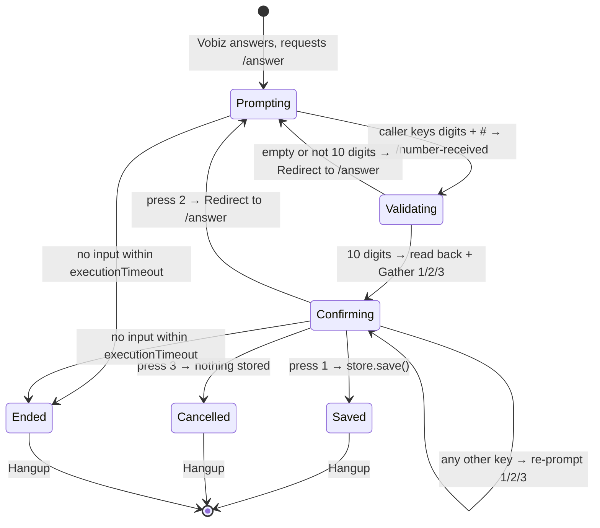

# Vobiz XML — Phone Number Capture (DTMF + # Terminator)

A runnable Vobiz XML sample (Python + FastAPI) that collects a caller's 10-digit phone number over DTMF, reads it back for confirmation, and stores the confirmed number behind a small lead/admin API.

[](./LICENSE)
[](https://www.python.org/)
[](https://fastapi.tiangolo.com/)
[](https://docs.vobiz.ai)

## Overview

Collecting a phone number by voice is deceptively hard. Ten digits is long enough that callers mistype, speech recognition mishears, and a single wrong digit means the callback never arrives. The reliable pattern is keypad entry with an explicit read-back: the caller types the number, the system repeats it digit by digit, and nothing is stored until the caller presses a key to confirm.

This repository implements that pattern end to end. Vobiz answers the call and requests your `/answer` URL. You return XML containing a `<Gather>` that captures DTMF until the caller presses `#`. Vobiz posts the collected digits to `/number-received`, which validates them and returns a second `<Gather>` offering three choices — confirm, re-enter, or cancel. Only on confirm does `/number-confirm` write the lead to storage. Every branch of that state machine, including an unrecognised keypress, is handled and re-prompted rather than dropped.

Alongside the voice flow the app exposes a small HTTP API over the captured leads: list, fetch one, delete, export to CSV, and a counters endpoint reporting totals, unique numbers, duplicates, and today's captures. Duplicate detection happens at capture time, so a caller who registers the same number twice is told so during the call and the lead is still recorded with `is_duplicate: true`.

It is aimed at developers building lead capture, callback request lines, or verification front-ends on Vobiz, and at anyone who wants a worked example of a multi-step confirmation flow in Vobiz XML. What you get at the end is a working phone number that a caller can ring, enter their number into, hear it read back, confirm — and a CSV you can download of everything captured.

## What you can build with it

- **Missed-call lead capture.** Advertise a number; callers ring in, key their mobile, and your sales team pulls the CSV or hits `/leads` for a live list.
- **Callback request lines.** Let callers leave a number to be rung back on rather than waiting in a queue, with the read-back preventing wrong-number callbacks.
- **Radio, print, and outdoor campaign response.** One DID per campaign; the `From` number and the captured number are both recorded, so you can distinguish the phone that called from the number the caller wants contacted on.
- **Delivery or service address confirmation.** Swap the 10-digit validator for a postcode, order number, or account number check and reuse the same confirm/re-enter/cancel scaffold.
- **Two-step verification enrolment.** Capture a number by voice as the first leg of an enrolment flow, then hand off to your own SMS or verification service.
- **IVR data entry generally.** The confirm-or-re-enter loop is the reusable part; the digit count is not.

## How it works

Vobiz fetches XML from your server at each step of the call, executes it, and posts the result back to the `action` URL you named. There is no long-lived session on your side — each webhook is a fresh HTTP request, and the state that must survive between steps (the number the caller typed) is carried in the query string of the confirmation `action` URL.

```
/answer
  └── "Enter your 10-digit number followed by #. You have 15 seconds."
        └── <Gather finishOnKey="#" executionTimeout="15">
              └── /number-received
                    ├── Invalid / empty → "Try again." → back to /answer
                    └── Valid (10 digits) → Read back: "You entered: 9, 8, 7, 6..."
                          └── Gather: 1=Confirm, 2=Re-enter, 3=Cancel
                                ├── 1 → "Number saved." → Hangup
                                ├── 2 → Back to /answer
                                └── 3 → "Cancelled." → Hangup
```

### The confirmation state machine

The interesting part is what happens after the read-back. Four outcomes are possible, and each returns different XML:



Three details are worth calling out:

- **Nothing is stored before confirmation.** `store.save()` is called in exactly one place — the `digit == "1"` branch of `/number-confirm`. Cancel and timeout write nothing.
- **The unrecognised-key branch loops in place.** Pressing `4` re-issues the same `<Gather>` with the same `action` URL, so the caller keeps their typed number and simply hears the options again. It does not send them back to the start.
- **Re-entry is a `<Redirect>`, not a retry.** Pressing `2` sends the caller back to `/answer`, which discards the previous attempt and starts a clean capture.

### Read-back

Digits are spelled out individually rather than read as a number, which is what makes the read-back checkable by ear. `_spell_number()` joins the digits with a comma and two spaces (`"9,  8,  7"`), and the punctuation is what makes the TTS engine pause between them.

## Architecture

| File | Responsibility |
|------|----------------|
| `server.py` | The whole FastAPI app: the four Vobiz webhooks that return XML, the five lead/admin endpoints, `/health`, DTMF validation, digit spelling, and ngrok tunnel setup in `main()`. |
| `lead_store.py` | `Lead` dataclass and the in-memory `LeadStore` — save with duplicate detection, get, delete, list (optionally excluding duplicates), CSV export, and counters. |
| `requirements.txt` | Pinned dependencies: FastAPI, Uvicorn, `python-multipart` (required to parse Vobiz's form-encoded webhooks), `python-dotenv`, `pyngrok`. |
| `.env.example` | Template for the three environment variables the app reads. Copy to `.env`. |
| `LICENSE` | MIT licence text. |

Route declaration order in `server.py` is load-bearing: `/leads/analytics` and `/leads/export.csv` are declared **before** `/leads/{lead_id}`. FastAPI matches in declaration order, so reversing them would make the literal paths get swallowed by the path parameter.

## Prerequisites

- **A Vobiz account** with at least one voice-enabled number. [Sign up](https://vobiz.ai) if you do not have one.
- **Python 3.9 or later.** `lead_store.py` uses built-in generic annotations (`dict[str, Lead]`, `list[dict]`). Python 3.11 or 3.12 is recommended.
- **`pip`** and, preferably, a virtual environment.
- **A public HTTPS URL.** Vobiz must reach your server from the internet. For local development the app starts an [ngrok](https://ngrok.com/) tunnel automatically via `pyngrok`; an ngrok account and auth token avoid the anonymous session limits. In production set `PUBLIC_URL` and skip ngrok entirely.

## Setup

1. **Clone the repository and enter it.**

   ```bash
   git clone https://github.com/vobiz-ai/Vobiz-Number-Capture-XML-Python.git
   cd Vobiz-Number-Capture-XML-Python
   ```

2. **Create a virtual environment and install dependencies.**

   ```bash
   python3 -m venv .venv
   source .venv/bin/activate      # Windows: .venv\Scripts\activate
   pip install -r requirements.txt
   ```

3. **Create your `.env`.**

   ```bash
   cp .env.example .env
   ```

   Leave `PUBLIC_URL` empty for local development. Add `NGROK_AUTH_TOKEN` if you have one. See [Configuration](#configuration) for the full list.

4. **Start the server.**

   ```bash
   python server.py
   ```

   It prints the public base URL and the four URLs you will need.

5. **Point your Vobiz number at the answer URL.** In the Vobiz console create an application whose **Answer URL** is `https://<your-public-url>/answer` with method `POST`, optionally set the **Hangup URL** to `https://<your-public-url>/hangup`, then assign that application to your number. See [Applications](https://docs.vobiz.ai/applications) for the full walkthrough.

6. **Call the number** and enter a 10-digit number followed by `#`.

## Configuration

Every variable the code actually reads, all from `.env` in the repository root:

| Variable | Required | Default | Description |
|----------|----------|---------|-------------|
| `HTTP_PORT` | No | `8000` | TCP port Uvicorn binds on. The ngrok tunnel is opened against this same port. |
| `PUBLIC_URL` | No | *(empty)* | The public HTTPS base URL of this server, without a trailing slash — it is stripped if present. When set, ngrok is not started and this value is used to build every `action` and `<Redirect>` URL in the XML. Set this in production. |
| `NGROK_AUTH_TOKEN` | No | *(empty)* | ngrok auth token, applied to the default pyngrok config before the tunnel opens. Only used when `PUBLIC_URL` is empty. Optional, but anonymous tunnels are rate-limited and short-lived. |

This example is inbound-only. It never calls the Vobiz REST API, so no auth ID or auth token is needed to run it — the Vobiz account credentials are used only in the console when you attach the application to your number.

## Running it

```bash
source .venv/bin/activate
python server.py
```

On startup you should see the banner:

```
============================================================
  08 — Phone Number Capture
  Answer URL    : https://<host>/answer
  View leads    : GET https://<host>/leads
  Export CSV    : GET https://<host>/leads/export.csv
  Analytics     : GET https://<host>/leads/analytics
============================================================
```

Confirm the process is healthy before you dial:

```bash
curl -s http://localhost:8000/health
# {"status":"ok","base_url":"https://...","example":"08_number_capture",
#  "total":0,"unique":0,"duplicates":0,"today":0}
```

Now ring your Vobiz number, key in ten digits and `#`, listen to the read-back, and press `1`. The log line to look for is:

```
2026-01-01 12:00:00 [INFO] Number received: '5550003333', CallUUID=...
2026-01-01 12:00:07 [INFO] Lead saved — id=..., number=5550003333, duplicate=False
```

Then read it back out over HTTP:

```bash
curl -s http://localhost:8000/leads | python3 -m json.tool
curl -s -OJ http://localhost:8000/leads/export.csv
```

## Endpoint reference

### Vobiz webhooks

Vobiz posts `application/x-www-form-urlencoded` bodies to these. All four return XML except `/hangup`.

| Method | Path | Purpose | Returns |
|--------|------|---------|---------|
| `POST` | `/answer` | Call entry point. Prompts for the number and opens the capture `<Gather>`. | `application/xml` — `<Gather>` with `finishOnKey="#"`, followed by a goodbye `<Speak>` and `<Hangup/>` as the no-input fallback. |
| `POST` | `/number-received` | Receives `Digits`. Rejects empty or non-10-digit input with a `<Redirect>` back to `/answer`; otherwise spells the number back and opens the confirmation `<Gather>`. | `application/xml` |
| `POST` | `/number-confirm` | Handles the confirmation keypress. `1` saves, `2` redirects to `/answer`, `3` cancels, anything else re-prompts. Carries `number`, `call_uuid`, and `from` in its own query string. | `application/xml` |
| `POST` | `/hangup` | Optional end-of-call notification. Logs the `CallUUID`. | `text/plain` — `OK` |

Form parameters consumed: `CallUUID`, `From`, and `Digits`. See [Gather](https://docs.vobiz.ai/xml/gather) for the complete list Vobiz sends.

### Lead and admin API

| Method | Path | Purpose | Response |
|--------|------|---------|----------|
| `GET` | `/leads` | List captured leads, newest first. Accepts `?include_duplicates=false` to hide repeats. | `200` — JSON array of lead objects. |
| `GET` | `/leads/analytics` | Counters over the store. | `200` — `{"total":0,"unique":0,"duplicates":0,"today":0}` (`today` is counted in UTC). |
| `GET` | `/leads/export.csv` | Download every lead, oldest first. | `200` — `text/csv` with `Content-Disposition: attachment; filename=leads.csv`. Header row: `id,captured_number,caller_number,call_uuid,timestamp,is_duplicate`. |
| `GET` | `/leads/{lead_id}` | Fetch one lead by its UUID. | `200` — a lead object; `404` — `{"detail":"Lead not found"}`. |
| `DELETE` | `/leads/{lead_id}` | Remove one lead. The number is dropped from the duplicate set only if no other lead still holds it. | `200` — `{"status":"deleted","id":"..."}`; `404` — `{"detail":"Lead not found"}`. |
| `GET` | `/health` | Liveness plus the analytics counters and the resolved `base_url`. | `200` — JSON. |

A lead object:

```json
{
  "id": "3f6c2b0e-1f2a-4c8d-9a11-7c0f5b2d84e6",
  "captured_number": "5550003333",
  "caller_number": "+15550003333",
  "call_uuid": "a1b2c3d4-....",
  "timestamp": "2026-01-01T12:00:07.512340",
  "confirmed": true,
  "is_duplicate": false
}
```

`captured_number` is what the caller typed; `caller_number` is the `From` on the call. They are frequently different, which is the point of asking.

## XML reference

| Element | Where | Notes |
|---------|-------|-------|
| [`<Gather>`](https://docs.vobiz.ai/xml/gather) | `/answer` | `inputType="dtmf"`, `finishOnKey="#"`, `executionTimeout="15"`. Variable-length capture: the caller signals completion with `#`. |
| [`<Gather>`](https://docs.vobiz.ai/xml/gather) | `/number-received`, `/number-confirm` | `inputType="dtmf"`, `numDigits="1"`, `executionTimeout="10"`. Single-key menu — Vobiz posts as soon as one digit lands. |
| [`<Speak>`](https://docs.vobiz.ai/xml/speak) | Everywhere | `voice="WOMAN"`, `language="en-US"`. Used both nested inside `<Gather>` as the prompt and standalone for the read-back and fallbacks. |
| [`<Redirect>`](https://docs.vobiz.ai/xml/redirect) | `/number-received`, `/number-confirm` | `method="POST"` back to `/answer` to restart the capture. |
| [`<Hangup>`](https://docs.vobiz.ai/xml/hangup) | Terminal branches | Ends the call after save, cancel, or a no-input timeout. |

### `executionTimeout`, not `timeout`

`<Gather>` in Vobiz XML has **no `timeout` attribute**. The attribute that bounds how long Vobiz waits for input is `executionTimeout`, valid from `5` to `60` seconds, defaulting to `15`. Its timer starts *after* the nested `<Speak>` or `<Play>` finishes, not when the element begins. The similarly named `timeout` belongs to [`<Dial>`](https://docs.vobiz.ai/xml/dial) and `<Number>`, where it bounds how long Vobiz waits for the B-leg to answer — a different concept entirely.

Both `<Gather>` elements in this repo use `executionTimeout`:

```xml
<Gather action="{BASE_URL}/number-received" method="POST"
        inputType="dtmf"
        finishOnKey="#"
        executionTimeout="15">
    <Speak voice="WOMAN" language="en-US">
        Welcome! Please enter your 10-digit mobile number,
        followed by the hash key.
    </Speak>
</Gather>
<Speak voice="WOMAN" language="en-US">We did not receive your number. Goodbye!</Speak>
<Hangup/>
```

The `<Speak>` and `<Hangup/>` after the `<Gather>` are the no-input path: when `executionTimeout` elapses Vobiz simply continues to the next element in the document. Always put a fallback there.

### `finishOnKey="#"`

- The caller enters a variable number of digits and presses `#` to submit.
- The `#` itself is **not** included in the `Digits` parameter — `_is_valid()` sees exactly ten characters.
- Set `finishOnKey=""` or `finishOnKey="none"` to rely on `numDigits` or the timeout instead.

### Changing the validation rule

Validation lives in one function in `server.py` and checks for exactly ten digits:

```python
def _is_valid(number: str) -> bool:
    return bool(re.fullmatch(r"\d{10}", number))
```

Edit that regex for a different length or format — an order number, a postcode, a fixed-length account reference — and the rest of the confirm/re-enter/cancel flow works unchanged.

### Persisting somewhere real

The single save point is the `digit == "1"` branch of `/number-confirm`. Replace or supplement `store.save()` there:

```python
if digit == "1":
    lead = store.save(number, from_num, call_uuid)
    # Your database
    db.save_phone_number(call_uuid=call_uuid, number=number)
    # Or your CRM
    requests.post("https://your-crm.example/api/contacts", json={"phone": number})
```

Keep the write on the confirm branch. Saving in `/number-received` would record every typo the caller corrected.

## Troubleshooting

| Symptom | Likely cause | Fix |
|---------|--------------|-----|
| Call connects, you hear nothing, then it hangs up | Vobiz could not reach your `action` URL, so it fell through to the fallback `<Speak>`/`<Hangup/>`. | Check the server log for the `/answer` request. If nothing arrives, the answer URL on the application is wrong or the tunnel URL changed. Restart and re-copy the printed URL, or set `PUBLIC_URL`. |
| Digits are collected but `/number-received` returns a 500 or an empty body | `python-multipart` is not installed, so `await request.form()` fails on the form-encoded webhook body. | `pip install -r requirements.txt` — it is a pinned dependency, not an optional extra. |
| Prompt plays, caller types digits, nothing happens until the call drops | The caller never pressed `#`, and `numDigits` is not set on the capture `<Gather>`. | The `#` terminator is required by design. Either say so more loudly in the prompt, or add `numDigits="10"` so Vobiz posts as soon as the tenth digit lands. |
| Every entry is rejected as "not a valid 10-digit number" | The caller is dialling a country code or a leading zero, so `Digits` is longer than ten characters. | Widen the regex in `_is_valid()`, or normalise before validating — strip a leading `0` or a known country prefix. |
| Read-back sounds like one long number rather than separate digits | `_spell_number()` was changed and lost its separator. | Restore the `",  "` join — the comma and double space are what make the TTS engine pause between digits. |
| `GET /leads/analytics` returns 404 "Lead not found" | The `/leads/{lead_id}` route was moved above the literal `/leads/analytics` route. FastAPI matches in declaration order, so the path parameter swallows `analytics`. | Keep `/leads/analytics` and `/leads/export.csv` declared before `/leads/{lead_id}` in `server.py`. |
| `/leads` is empty after a restart | The store is in memory. Restarting the process clears every captured lead. | Export before restarting, or wire a real database in at the save point (see [Persisting somewhere real](#persisting-somewhere-real)). |
| ngrok fails to start, or the tunnel dies after a few minutes | No `NGROK_AUTH_TOKEN`, so the anonymous session limits apply. | Add an ngrok auth token to `.env`, or set `PUBLIC_URL` and run behind your own HTTPS endpoint. |
| Port 8000 already in use | Another process is bound to `HTTP_PORT`. | Set `HTTP_PORT` to a free port in `.env` — the tunnel follows it automatically. |

## Security notes

The data this example handles is personal data. Captured phone numbers identify individuals, and in most jurisdictions — GDPR, CCPA, India's DPDP Act — they are regulated personal information. Treat the following as required work before this pattern goes anywhere near real callers:

- **The lead and admin API is unauthenticated.** `GET /leads`, `GET /leads/export.csv`, and `DELETE /leads/{id}` are open to anyone who can reach the port. On a public tunnel that is the entire internet, and `export.csv` hands over every number in one request. Put the `/leads*` routes behind an API key, session auth, or a network boundary before exposing them, and do not run the ngrok tunnel unattended.
- **Verify that webhook requests really come from Vobiz.** The XML endpoints act on whatever posts to them. Validate the request signature on inbound webhooks — see [webhooks and signatures](https://docs.vobiz.ai/guides/plivo-to-vobiz/webhooks-and-signatures) — or at minimum restrict the routes to Vobiz's source addresses.
- **The captured number travels in a query string.** `/number-confirm` receives `number`, `call_uuid`, and `from` as URL parameters. Query strings land in access logs, proxy logs, and error trackers far more readily than request bodies do. If you keep this design, scrub those logs; if you need to harden it, store the pending number server-side keyed by `CallUUID` and pass only the key.
- **The values interpolated into the XML are not escaped or URL-encoded.** DTMF input is constrained to digits, so the current flow is safe, but if you extend the app to interpolate speech transcriptions, caller names, or any other free text into `<Speak>` or into an `action` URL, XML-escape it and URL-encode it first.
- **Consent and retention.** Record what the caller was told before they keyed their number, keep the leads no longer than you need them, and give yourself a delete path — `DELETE /leads/{id}` exists for exactly that, but only works while the process is alive.
- **Keep `.env` out of version control.** It is already in `.gitignore`. Load production values from your platform's secret manager rather than a file on disk.
- **Serve over HTTPS only.** Vobiz requires it for webhook URLs, and the read-back flow carries personal data in both directions.

## Roadmap

> Planned improvements to this example. Ideas and pull requests are welcome —
> open an issue to discuss anything here.

- [ ] Swap `LeadStore` for a real database (SQLite for local runs, Postgres for deployment) so captured leads survive a restart, with the same `save`/`get`/`delete`/`analytics` surface.
- [ ] Add authentication to the `/leads*` routes — an API key header to start, with room for OAuth or session auth — so the admin API is not open by default.
- [ ] Validate inbound webhook signatures on `/answer`, `/number-received`, `/number-confirm`, and `/hangup`.
- [ ] Normalise captured numbers to E.164 and validate them properly (country code inference, mobile-versus-landline classification) instead of a bare ten-digit regex, so duplicate detection compares like with like.
- [ ] Add an outbound CRM webhook fired on confirm, with retries and a dead-letter path, so a downstream failure does not lose a lead.
- [ ] Add a pytest suite covering the XML returned by each branch of the state machine — valid, invalid, empty, confirm, re-enter, cancel, unrecognised key — plus `LeadStore` duplicate and delete behaviour.
- [ ] Replace the deprecated `datetime.utcnow()` calls with timezone-aware `datetime.now(timezone.utc)`, and make the `today` counter respect a configurable reporting timezone rather than always using UTC.
- [ ] Add structured logging and a metrics endpoint so completion rate, re-entry rate, and cancellation rate per campaign number are visible without reading the log.

## Contributing

Issues and pull requests are welcome. If you are changing the call flow, please describe the branch you exercised and how you tested it — a real call is the only complete test today.

Before opening a pull request:

```bash
python -m compileall server.py lead_store.py   # syntax check
python server.py                               # boots and prints the banner
curl -s http://localhost:8000/health           # returns status ok
```

Keep the XML valid, keep `executionTimeout` (not `timeout`) on `<Gather>`, and do not commit a `.env`.

## License

Released under the [MIT License](./LICENSE) © Vobiz.

MIT is permissive: you may use, modify, and redistribute this code, including in
closed-source commercial products, provided the copyright notice and licence text
are retained. There is no warranty. If your organisation needs a different
licensing arrangement, contact [piyush@vobiz.ai](mailto:piyush@vobiz.ai).

## Built by Team Vobiz

[Vobiz](https://vobiz.ai) is a programmable voice and SIP-trunking platform for
voice APIs, SIP trunking, and AI voice agents. This repository is built and
maintained by the Vobiz team.

**Maintainer:** Piyush Sahoo — [piyush@vobiz.ai](mailto:piyush@vobiz.ai) · [LinkedIn](https://www.linkedin.com/in/piyush-s713/)

Questions, or want to talk through an integration? Open an issue on this repo,
or reach out directly at [piyush@vobiz.ai](mailto:piyush@vobiz.ai).

**Useful links:** [Docs](https://docs.vobiz.ai) · [API reference](https://docs.vobiz.ai/api-reference) · [Sign up](https://vobiz.ai)
